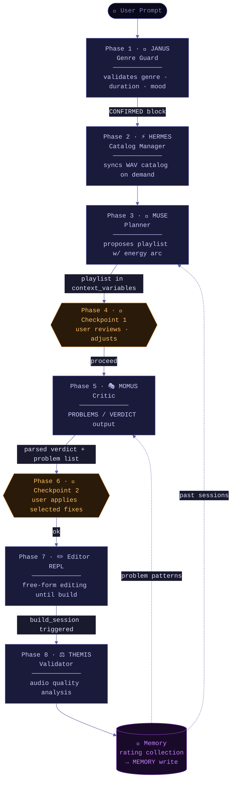

# ApolloAgents: A Multi-Agent Architecture for Autonomous DJ Set Generation

**Pablo Formoso**
Independent Research · April 2026

---

## Abstract

This paper presents ApolloAgents, an AI-powered system that transforms a collection of audio tracks into a fully rendered DJ mix video through a coordinated pipeline of specialised language model agents. The system addresses the inherent complexity of DJ set curation — harmonic compatibility, energy arc design, rhythmic continuity, and audio quality — by decomposing the problem across six agents with distinct, bounded roles: a Genre Guard, a Catalog Manager, a Planner, a Critic, a Validator, and a human-in-the-loop Orchestrator. Each agent communicates through structured text protocols and a shared context object, avoiding the overhead of distributed message buses while preserving the modularity benefits of multi-agent design. A persistent session memory allows agents to learn from past sessions, progressively improving track avoidance, energy arc selection, and transition quality over time. Version 1.3 extends the pipeline with BPM stretch safety bounds, bridge track insertion tooling, and crossfade EQ matching to reduce frequency masking at transitions. Version 1.5 introduces LiveMode — a real-time DJ engine backed by a proactive LiveDJ agent that monitors the active mix and makes autonomous transition decisions, extending the system from a batch pipeline to a real-time interactive performance tool. The full pipeline — from prompt to lossless WAV mix to 1080p YouTube video with AI-generated artwork — runs without human intervention beyond two interactive checkpoints.

---

## 1. Introduction

Creating a DJ mix is a compositional act that balances multiple musical dimensions simultaneously. A skilled DJ considers harmonic compatibility between tracks (so key changes do not clash), BPM continuity (so tempo transitions feel natural rather than jarring), energy arc (so the set has a narrative shape — warmup, build, peak, release), and audio quality (so no individual track bleaches, clips, or drops into silence). This is a rich, multi-constraint optimisation problem that resists reduction to a single prompt or a simple ranking function.

Large language models excel at tasks requiring structured reasoning, preference modelling, and natural language interaction. However, a single general-purpose agent asked to "plan a 60-minute techno set" will tend to produce superficially plausible but musically shallow results: it lacks the domain specificity to analyse harmonic wheels, the numerical grounding to evaluate BPM clusters, and the self-critical distance to review its own choices objectively.

ApolloAgents decomposes the problem into a pipeline of agents, each specialised for a single phase of the workflow. This mirrors professional DJ practice: a promoter confirms the brief, a music researcher curates the catalog, a set planner proposes a running order, an A&R person critiques it, and an engineer handles the technical render. The system encodes this division of labour into distinct agents with clearly bounded system prompts, tool access, and output formats.

The contributions of this work are:

1. A practical multi-agent architecture for creative audio production, implemented without orchestration frameworks
2. A structured text protocol for inter-agent communication (CONFIRMED blocks, PROBLEMS/VERDICT format, Status: fields)
3. A lossless audio pipeline addressing the crossfade clipping problem endemic to naive pydub-based mixing
4. A persistent session memory that allows agents to improve recommendations based on accumulated user feedback
5. A full video production pipeline integrating spectral waveform visualisation, beat-reactive particles, and AI-generated artwork
6. BPM stretch safety bounds and bridge track insertion tooling (v1.3) that prevent time-stretching artefacts and give the Editor agent a structured path to resolve extreme tempo gaps
7. A real-time proactive DJ agent (LiveDJ, v1.5) that monitors a live mix in progress and makes autonomous transition decisions within a bounded LLM turn budget

---

## 2. Background

### 2.1 The Camelot Wheel

The Camelot Wheel is a harmonic mixing reference system developed by Mark Davis that maps Western musical keys onto a clock face. Each position represents a key (e.g., 8A = A minor, 8B = C major). Two tracks are considered harmonically compatible if their Camelot positions are:

- **Identical** — same key, always safe
- **Adjacent by number** (±1) — relative key shift, smooth transition
- **Adjacent by letter** (A↔B at same number) — parallel major/minor, slightly bolder

Transitions two steps apart are acceptable with technique; larger jumps risk audible key clash. ApolloAgents encodes this as a graph neighbour function:

```python
def _camelot_neighbors(key: str) -> set[str]:
    num = int(key[:-1])
    letter = key[-1].upper()
    opposite = "B" if letter == "A" else "A"
    return {
        key,
        f"{(num % 12) + 1}{letter}",       # +1 clockwise
        f"{((num - 2) % 12) + 1}{letter}", # -1 counter-clockwise
        f"{num}{opposite}",                 # parallel key
    }
```

The harmonic sort algorithm performs a greedy random walk on this graph to produce a compatible running order from a pool of clustered tracks.

### 2.2 BPM Matching

Professional DJ mixing involves beatmatching: aligning the tempo of the incoming track to the outgoing track before the crossfade begins. ApolloAgents implements tempo matching via `pyrubberband`, a Python wrapper around the Rubber Band Library which uses phase-vocoder time-stretching to change playback speed without altering pitch. Tracks within `BPM_MATCH_THRESHOLD` (5 BPM) are played at their native tempo; larger differences trigger a 16-second ramp (`TEMPO_RAMP_SEC`) that linearly interpolates BPM across `RAMP_STEPS = 24` micro-segments for a smooth transition.

### 2.3 The Crossfade Clipping Problem

A widely overlooked issue in programmatic mixing is that crossfading two audio signals at full amplitude causes additive clipping. If both tracks peak at 0 dBFS, their sum during overlap reaches +6 dBFS — beyond the representable range — producing digital distortion. The system addresses this with two mitigations:

1. **Pre-mix gain reduction**: every track is attenuated by −3 dB before mixing (`segment = segment - 3`)
2. **Post-mix normalisation**: if the final mix peaks below −1 dBFS, it is normalised to recover headroom

Additionally, per-crossfade peak monitoring warns when the overlap zone exceeds −0.5 dBFS, allowing detection without requiring a full librosa analysis pass.

### 2.4 Multi-Agent Systems for Creative Tasks

Prior work has explored LLM agents for creative generation in domains including code synthesis, game design, and narrative writing. The ApolloAgents architecture draws inspiration from the AutoAgent pattern of specialised subagents with bounded tool access, but implements it directly against the Anthropic and OpenAI APIs rather than relying on an orchestration framework. This keeps the dependency surface minimal and makes the control flow inspectable in a single file.

---

## 3. System Architecture

### 3.1 Overview

ApolloAgents structures the mix creation process as an 8-phase sequential pipeline. Each phase is handled by a dedicated agent with a fixed system prompt, a curated subset of tools, and a structured output format. Shared mutable state is carried in a `context_variables` dictionary injected by the orchestrator.



### 3.2 Agent Roles and Constraints

| Agent | Mythological Name | Tools Available | Output Protocol |
|---|---|---|---|
| Genre Guard | Janus | `list_genres` | CONFIRMED block |
| Catalog Manager | Hermes | `catalog_status`, `rebuild_catalog`, `fix_incomplete` | Free text |
| Planner | Muse | `get_catalog`, `propose_playlist`, `get_energy_arc` | Free text + playlist |
| Checkpoint | — | `show_playlist`, `swap_track`, `move_track` | PROCEED sentinel |
| Critic | Momus | `show_playlist`, `analyze_transition` | PROBLEMS/VERDICT |
| Editor | — | `show_playlist`, `swap_track`, `move_track`, `suggest_bridge_track`, `insert_bridge_track`, `build_session`, `play_mix`, `preview_transition`, `play_track`, `start_live_session` | Free text |
| Validator | Themis | `validate_audio` | Status: PASS/WARNING/FAIL |
| LiveDJ | — | `get_live_state`, `crossfade_now`, `extend_track`, `skip_track`, `queue_swap`, `set_crossfade_point` | Real-time terse responses |
| Orchestrator | Apollo | All | Manages state |

Tool access is enforced at system prompt level, not at the API schema level — each agent is only shown the tools it is permitted to use. This prevents tool misuse without requiring a separate permission layer.

### 3.3 Structured Text Protocols

Inter-agent communication relies on structured text blocks that can be parsed deterministically with lightweight string routines, avoiding the fragility of asking the LLM to produce JSON and the overhead of schema validation:

**Genre Guard output:**
```
CONFIRMED
genre: techno
duration_min: 60
mood: dark industrial build to a hard peak
```

**Critic output:**
```
PROBLEMS:
- [pos 2→3] key clash 5A → 11A — fix: swap pos 3 for a 6A track
- [pos 7→8] BPM jump 132 → 148 — fix: insert bridge track

VERDICT: NEEDS_FIXES
```

**Validator output:**
```
Status: WARNING
Issues (1):
- [00:34] High spectral flatness (0.47) — possible noise in 30s window
```

Each parser (`_parse_confirmed_block`, `_parse_critic_response`, `_parse_validator_response`) uses simple line-by-line iteration, making them robust to surrounding prose and easy to unit-test.

### 3.4 Tool Schema Auto-Generation

Rather than maintaining hand-written tool schemas, ApolloAgents auto-generates Anthropic and OpenAI tool definitions from Python function signatures and docstrings at runtime:

```python
def _build_properties(fn) -> tuple[dict, list[str]]:
    sig = inspect.signature(fn)
    doc = inspect.getdoc(fn) or ""
    arg_docs = _parse_arg_docs(doc)
    for name, param in sig.parameters.items():
        if name == "context_variables":
            continue  # injected by orchestrator, never exposed to LLM
        ...
```

The `context_variables` parameter is automatically excluded from every tool schema. This means tools can carry orchestrator-managed state without polluting the LLM's parameter space.

---

## 4. Audio Processing Pipeline

### 4.1 Catalog Construction

Track metadata is computed once and stored in `tracks/tracks.json`. For each WAV file:

- **BPM detection**: `librosa.beat.beat_track()` with genre-specific clamping ranges (e.g., techno: 120–160 BPM, lofi-ambient: 60–110 BPM) to correct octave errors common in librosa's beat tracker
- **Key detection**: `librosa.feature.chroma_cqt()` mapped through a Camelot lookup table
- **ID generation**: slugified `genre_folder--display_name` string, stable across catalog rebuilds
- **Variant handling**: tracks sharing a `display_name` (e.g., a full version and a radio edit) share `variant_of` linkage and AI-generated artwork

### 4.2 Playlist Construction

Track selection follows a two-stage process:

1. **BPM clustering** — tracks are sorted by tempo and grouped into ±10 BPM clusters; the largest cluster is selected to ensure rhythmic cohesion
2. **Harmonic sort** — a greedy random walk on the Camelot compatibility graph orders tracks within the cluster, maximising smooth key transitions

The cluster + harmonic walk approach is intentionally stochastic: seeding `random` differently produces valid but varied orderings, giving the Planner agent multiple options to reason about.

### 4.3 Mix Rendering

The mix is assembled with pydub and pyrubberband:

1. Each track is loaded as a pydub `AudioSegment` and attenuated by −3 dB
2. If the BPM difference between consecutive tracks exceeds the threshold, the incoming track is time-stretched to meet in the middle over `TEMPO_RAMP_SEC` seconds using pyrubberband. The time-stretch ratio is capped at `_STRETCH_MAX = 1.5` (and floored at `_STRETCH_MIN = 1/1.5`) to prevent the audible artefacts that pyrubberband produces at more extreme ratios. Transitions requiring a ratio beyond this bound are flagged as mandatory PROBLEMS entries by MOMUS, triggering bridge track insertion by the Editor.
3. Before the crossfade is applied, `_apply_crossfade_eq(segment, role, key_distance)` processes both the outgoing and incoming segments with shelving EQ: the outgoing track receives a high-shelf cut of −3 dB at 8 kHz when `key_distance > 2`, and the incoming track receives a low-shelf cut of −3 dB at 250 Hz to reduce low-frequency mud in the overlap zone. This reduces frequency masking without affecting audio outside the crossfade window.
4. Crossfades of `CROSSFADE_SEC = 12` seconds are applied between tracks
5. A per-crossfade peak check warns if the overlap zone exceeds −0.5 dBFS
6. The complete mix is exported as 32-bit WAV (lossless); normalisation is applied if headroom is available

### 4.3.1 Bridge Track Insertion

When the Critic flags a transition as requiring a stretch ratio beyond the 1.5× safety bound, the Editor agent can invoke two purpose-built tools to resolve it interactively:

- **`suggest_bridge_track(from_pos, to_pos)`** — scans the catalog for tracks whose BPM falls between the two playlist positions. Candidates are scored by `min(ratio_a, 1/ratio_a) × min(ratio_b, 1/ratio_b)`, where each ratio is `target_bpm / candidate_bpm`. The top 3 candidates are returned ranked by score.
- **`insert_bridge_track(after_position, track_id)`** — inserts the chosen track into the working playlist immediately after the specified position, splitting the problematic transition into two individually safe ones.

This pattern — Critic flags, Editor resolves — keeps the fix interactive and under user control while giving the agent a principled search over the catalog rather than a freeform guess.

### 4.4 Audio Quality Validation

THEMIS runs four librosa-based checks on the exported WAV:

| Check | Method | Threshold | Interpretation |
|---|---|---|---|
| Peak clipping | `max(abs(y)) >= 0.98` | Any occurrence | Digital distortion from gain staging |
| Spectral flatness | `librosa.feature.spectral_flatness()` per 30s window | mean > 0.4 | Noise, bleached audio, or excessive compression |
| Silence gaps | RMS < 0.005 for > 2s | Duration > 2s | Dropout, bad crossfade, or missing segment |
| RMS anomaly | 20·log10(rms[w]/rms[w-1]) | Drop > 12 dB | Sudden volume collapse between adjacent windows |

A spectral flatness value near 0 indicates a tonal, music-like signal; values approaching 1 indicate white noise. The 0.4 threshold was empirically calibrated against known-clean mixes and mixes with confirmed bleaching artefacts.

### 4.5 Video Rendering

The video pipeline uses moviepy and Pillow to produce a 1920×1080 24fps video with:

- **Background**: DALL-E 3 generated artwork, prompted per genre with a style-specific template (anime for lofi-ambient, dark-techno cyberpunk for techno, deep-house-neon for deep house). Artwork is deduplicated by `display_name` across sessions.
- **Spectral waveform visualiser**: real-time amplitude envelope with 6-band spectral coloring (sub-bass → treble), rendered per-frame via numpy operations
- **Beat-reactive particles**: 150 particles drifting at 15px/s, alpha-pulsing on detected beats with a 2-second decay envelope
- **Retro pixel titles**: Press Start 2P font with slide-in animation and sinusoidal glow pulse

A YouTube Short (1080×1920, 20 seconds) is generated alongside the full video, pulling the first 20 seconds with fade-in and fade-out and repositioning elements for the vertical aspect ratio.

---

## 5. Session Memory

### 5.1 Design Rationale

A fundamental limitation of stateless LLM agents is that they repeat mistakes. A Planner that proposed a weak track in session 1 will propose it again in session 2 unless given explicit context about its previous performance. ApolloAgents addresses this with a persistent `agent/memory.json` file updated after every rated session.

### 5.2 Memory Schema

```json
{
  "schema_version": 1,
  "sessions": [
    {
      "session_name": "dark-techno-vibe",
      "timestamp": "2026-04-07T20:27:00",
      "genre": "techno",
      "duration_min": 60,
      "mood": "dark build to peak",
      "rating": 4,
      "notes": "peak section worked well",
      "critic_verdict": "NEEDS_FIXES",
      "critic_problems": ["[pos 3→4] key clash — swap track 4"],
      "validator_status": "PASS",
      "validator_issues": [],
      "tracks_swapped": ["Rave Doctrine"],
      "final_playlist": ["Hex Code", "Tesla Coil", "Acid Rain"]
    }
  ]
}
```

The file is capped at 50 sessions (oldest dropped on overflow) and written atomically via a temp file and `os.replace()` to prevent corruption on crash.

### 5.3 Memory Injection

Before each planning session, `read_memory(genre)` computes three summaries from the last 10 genre-matching sessions and injects them into the Planner and Critic system prompts:

1. **Avoid list** — tracks swapped out in 2 or more past sessions (user consistently rejected them)
2. **High-rated patterns** — mood, arc, and track combinations from sessions rated ≥ 4/5
3. **Recurring critic problems** — transition issue patterns appearing in 2 or more sessions

This gives both agents personalised, genre-specific context without requiring the LLM to process raw session history.

### 5.4 Swap Tracking

The orchestrator captures the initial playlist after Phase 3 and computes the symmetric difference with the final playlist before writing the memory record:

```python
tracks_swapped = sorted(
    initial_playlist_names - {t["display_name"] for t in final_playlist}
)
```

This identifies tracks the user chose to remove during editing — a signal stronger than explicit negative feedback, as it reflects revealed preference under time pressure.

---

## 6. Implementation Details

### 6.1 Provider Agnosticism

ApolloAgents supports Anthropic Claude, OpenAI GPT models, and locally-hosted Ollama models through a single `run_agent()` function that branches on the detected provider. Provider detection follows a priority order: Anthropic is preferred when its API key is present, OpenAI is next, and Ollama is selected when neither cloud key is available but an Ollama instance is reachable:

```python
if _HAS_ANTHROPIC:
    _PROVIDER = "anthropic"
elif _HAS_OPENAI:
    _PROVIDER = "openai"
elif os.getenv("OLLAMA_BASE_URL") or _ollama_running():
    _PROVIDER = "ollama"
```

Ollama uses the OpenAI-compatible SDK with `base_url="http://localhost:11434/v1"` and `api_key="ollama"`, defaulting to the `gemma4:4b` model. This allows fully offline operation without any API keys, useful for development and privacy-sensitive deployments. Tool schemas are built separately for each provider format (`_build_anthropic_schemas`, `_build_openai_schemas`) from the same Python function signatures, ensuring consistent behaviour regardless of which LLM is used.

### 6.2 Single-File Core Pipeline

`main.py` (~2,600 lines) contains the entire audio and video pipeline. This was a deliberate architectural choice: for a project of this scope, a single inspectable file with clear section headers is more maintainable than a module hierarchy that would require navigating multiple files for every change. The agent layer (`agent/`) is kept separate because its iteration cycle (prompt engineering, tool signatures, memory schema) differs fundamentally from the DSP pipeline.

### 6.3 Testing Strategy

The test suite covers all pure logic components: Camelot compatibility functions, structured text parsers, and memory read/write behaviour. Components that depend on audio files, API keys, or subprocess execution are excluded from automated tests — these are validated through end-to-end session runs. The boundary is enforced by the `sys.exit()` guard being placed in `run()` rather than at module scope, allowing `agent.run` to be safely imported in test environments without API keys present.

---

## 7. Live Mode

### 7.1 Architecture

LiveMode is a real-time DJ engine that runs a continuous mix through the system's audio output while a proactive agent monitors the playback state and makes autonomous transition decisions. The core component is `LiveEngine` (`agent/live_engine.py`), a two-deck engine built on `sounddevice.OutputStream`.

The engine runs four concurrent threads:

| Thread | Interval | Responsibility |
|---|---|---|
| sounddevice callback | Per block (2048 samples) | Low-latency audio output; linear crossfade blend |
| Watchdog | 50 ms | Monitors sample position; fires transition events |
| Pre-stretch daemon | Continuous | Time-stretches the next track in the background via pyrubberband |
| Main event loop | 100 ms | Dispatches events to the LiveDJ agent |

The watchdog fires at twice the frequency of the event loop, ensuring that time-critical transitions (crossfade triggers, track endings) are detected before the next agent poll cycle.

**Event model.** The engine emits six events consumed by the agent:

- `TRACK_STARTED` — new track has begun playing
- `APPROACHING_CF` — fired 30 seconds before the calculated crossfade point
- `CROSSFADE_TRIGGERED` — crossfade blend has begun
- `CROSSFADE_FINISHED` — blend complete; outgoing deck released
- `TRACK_ENDED` — current track has played through without crossfade
- `SESSION_ENDED` — playlist exhausted

**Crossfade.** The 12-second blend is computed in float32 stereo numpy arrays as a linear fade: `out*(1-t) + in*t` where `t` runs from 0 to 1. This matches the offline pipeline's crossfade model, ensuring consistent perceived loudness behaviour.

**Pre-stretching.** The next track is time-stretched by pyrubberband in the background while the current track plays. A `_prestretch_ready` threading Event gates the crossfade trigger, so by the time the watchdog fires `CROSSFADE_TRIGGERED` the stretched audio is always available in memory. This eliminates the stutter that would occur if stretching were performed on demand at transition time. The same 1.5× ratio cap applied in the offline pipeline is enforced here.

### 7.2 Apollo LiveDJ Agent

The LiveDJ agent (`agent/live_dj.py`) is a purpose-built agent with a terse, action-oriented system prompt (`_LIVE_DJ_SYSTEM`) optimised for low-latency decisions during live playback. It receives events from the engine's event loop and responds with tool calls.

**Decision rules on `APPROACHING_CF`.** The agent applies a three-tier decision rule based on the Camelot distance and BPM difference between the current and next track:

| Condition | Action |
|---|---|
| Camelot ≤1 step AND BPM diff ≤8 | Silent — let the automatic crossfade proceed |
| Camelot 2 steps OR BPM diff 8–20 | `extend_track(20)` — buy time, reassess |
| Camelot >2 steps OR BPM diff >20 | `crossfade_now()` or `queue_swap()` |

**LLM budget.** The agent is limited to 5 turns per event batch. This prevents unbounded token spend during continuous live playback, where events arrive every few seconds over a multi-hour session. If the budget is exhausted without a terminal tool call, the engine falls back to the automatic transition.

**User commands.** The event loop accepts keyboard commands that are translated into tool calls without LLM mediation for latency:

| Command | Tool |
|---|---|
| `next` / `skip` | `crossfade_now()` |
| `stay` / `longer` | `extend_track(30)` |
| `more energetic` | `queue_swap()` with higher BPM candidate |
| `wind down` / `chill` | `queue_swap()` with lower BPM candidate |

### 7.3 Live Tools

| Tool | Description |
|---|---|
| `get_live_state()` | Returns current track, position_sec, BPM, Camelot key, seconds_to_crossfade, playlist_remaining |
| `crossfade_now()` | Advances the playback position to `cf_point_samples` so the watchdog fires the crossfade immediately |
| `extend_track(seconds)` | Adds N×44100 samples to `_extend_samples`, shifting the crossfade threshold without touching audio buffers |
| `skip_track()` | Hard-cuts to the next track with no blend |
| `queue_swap(position, track_id)` | Replaces a future playlist slot with the specified track |
| `set_crossfade_point(position_sec)` | Manual override of when the crossfade blend begins |

### 7.4 Hot Cues

Tracks can carry `hot_cues: [{type: "out", position_sec: N}, {type: "in", position_sec: N}]` entries in the catalog. An `OUT` cue overrides the default crossfade point (normally `duration − 17s`), allowing a precise musical exit point to be encoded at catalog build time. An `IN` cue sets the sample offset where the incoming track starts playing during the blend, enabling clean phrase-aligned entries. Hot cues are designed to be importable from Rekordbox XML in a future extension (see Section 10).

### 7.5 Key Design Decisions

**Pre-stretch runs ahead.** Crossfades are instant from the user's perspective because pyrubberband completes its work during the preceding track's playback. The `_prestretch_ready` event gate ensures the crossfade never fires before the buffer is ready.

**Watchdog at 50 ms / event loop at 100 ms.** The engine fires events twice as fast as the LLM polls. This means that even if an agent turn takes the full 100 ms budget, the watchdog has already confirmed the audio state is consistent. Decoupling the audio-critical path from LLM latency is essential for a real-time system.

**5-turn LLM budget.** Without a hard turn cap, an agent that encounters an ambiguous situation could issue a chain of reasoning turns during playback. The 5-turn limit forces the agent to commit to an action or fall back to the default within a bounded window.

**`_extend_samples` for crossfade shifting.** Rather than modifying audio buffers or recomputing mix positions, `extend_track()` simply increments a counter that the watchdog reads before comparing against the crossfade threshold. This is lock-free (the counter is an integer) and has no effect on audio output.

---

## 8. Design Decisions and Trade-offs

### 8.1 No Orchestration Framework

Several multi-agent frameworks exist (LangGraph, AutoGen, CrewAI, AutoAgent) that provide graph-based routing, memory stores, and tool registries. ApolloAgents implements equivalent patterns directly against the provider SDKs. The trade-off is more boilerplate in `run.py` in exchange for no hidden abstractions, no additional dependencies, and full control over the conversation loop — important for a creative application where the exact sequencing of agent responses and checkpoint interactions matters.

### 8.2 Structured Text vs JSON

Requiring the LLM to produce JSON for inter-agent communication introduces fragility: models occasionally produce malformed JSON, trailing commas, or extra explanation text that breaks parsers. Structured text blocks with sentinel keywords (CONFIRMED, VERDICT, Status:) are more robust — partial matches still allow extraction, and fallback defaults (APPROVED, PASS) prevent cascading failures when the model deviates from format.

### 8.3 Checkpoints as First-Class Design

Most automated pipelines treat human review as an afterthought — a final approval gate. ApolloAgents places two interactive checkpoints inside the pipeline, before and after the Critic. This reflects a key insight: the Critic's value is in surfacing problems, not in enforcing fixes. The user may disagree with a Critic recommendation, prefer a different fix, or accept a known issue. Automating the application of Critic feedback would override this judgment. The checkpoints make the pipeline collaborative rather than autonomous.

### 8.4 Lossless Intermediate Format

All intermediate audio is kept as 32-bit WAV. The only lossy encoding step is the final AAC pass at 320kbps during video mux. This ensures that BPM time-stretching artefacts (which accumulate with re-encoding) stay at the minimum possible level, and that the Validator's spectral analysis operates on uncompressed data.

---

## 9. Results and Observations

Over the development period spanning versions 0.0 through 1.0, the following qualitative improvements were observed:

**Audio quality**: The introduction of −3 dB pre-mix gain and the crossfade peak monitor eliminated the spectral bleaching that affected early sessions. THEMIS now consistently reports PASS on sessions produced with default settings.

**Harmonic coherence**: The Camelot-based harmonic sort reduced key clash warnings from appearing in the majority of early sessions to being a rare MOMUS flag, typically appearing only when the catalog lacks compatible options for a specific BPM cluster.

**Agent memory utility**: After 5+ sessions per genre, the avoid list meaningfully constrains the Planner's choices. Tracks that were consistently swapped out — typically those with unusual tempo or poor recording quality — no longer appear in initial proposals.

**Checkpoint value**: User edits at Checkpoint 1 (pre-Critic) typically address energy arc concerns; edits at Checkpoint 2 (post-Critic) address specific transition fixes flagged by MOMUS. Separating these concerns reduces cognitive load compared to presenting all feedback simultaneously.

---

## 10. Future Work

**Hot cue library import from Rekordbox XML**: Tracks can already carry `hot_cues` entries defining precise IN and OUT points for crossfades. Importing these automatically from a Rekordbox XML export would allow a DJ's existing cue point library — built over years of professional practice — to guide LiveMode transitions without manual catalog annotation.

**Genre cross-pollination**: Multi-genre sessions (e.g., a transition from deep house to techno) are not currently supported — the Genre Guard enforces a single genre per session. Relaxing this constraint, while maintaining harmonic and BPM continuity across the boundary, is a natural extension.

**Beat-synchronised crossfade**: The current crossfade triggers at a fixed sample offset derived from track duration. Aligning the crossfade start to the nearest beat boundary — detected via `librosa.beat.beat_track()` on the live buffer — would produce transitions that feel more musically intentional, particularly in genres with strong four-on-the-floor rhythms.

---

## 11. Conclusion

ApolloAgents demonstrates that a structured multi-agent pipeline can successfully address the creative and technical complexity of DJ set production. By assigning bounded roles to specialised agents, enforcing structured text protocols for inter-agent communication, and maintaining a persistent session memory, the system produces musically coherent, technically clean mixes with minimal human intervention. The two interactive checkpoints preserve user agency at the moments where subjective musical judgment matters most, while the automated agents handle the combinatorial and analytical work that would otherwise require deep domain expertise. The addition of LiveMode in v1.5 extends the system beyond batch pipeline into real-time interactive performance, demonstrating that the same agent architecture that plans a mix offline can also monitor and adjust it live — within a bounded computational budget and without compromising audio continuity.

The full system — agent pipeline, audio DSP, video renderer, and test suite — is available as open source under the MIT License.

---

## References

1. Davis, M. (2004). *The Camelot System for Harmonic Mixing*. Mixed In Key LLC.
2. McFee, B. et al. (2015). *librosa: Audio and Music Signal Analysis in Python*. Proceedings of the 14th Python in Science Conference.
3. Rubber Band Library. Breakfast Quay. https://breakfastquay.com/rubberband/
4. Anthropic. (2024). *Claude API Documentation*. https://docs.anthropic.com
5. OpenAI. (2024). *GPT-4o Technical Report*. https://openai.com/research/gpt-4o
6. HKUDS. (2024). *AutoAgent: Automatic Agent Creation and Coordination Framework*. https://github.com/HKUDS/AutoAgent
7. Geier, M. (2012). *sounddevice: Play and Record Sound with Python*. https://python-sounddevice.readthedocs.io

---

*ApolloAgents is open source — MIT License. Source code and examples at [github.com/pabloformoso/apollo-agents](https://github.com/pabloformoso/apollo-agents).*
