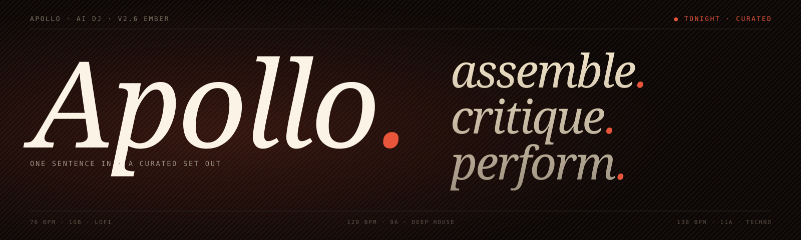

# Apollo

[](https://github.com/pabloformoso/apollo-agents/actions/workflows/ci.yml)
[](https://www.python.org/)
[](LICENSE)
[](ROADMAP.md)



> **Apollo is an AI Music Entertainment System:** a place to imagine music, shape it with a team of specialist collaborators, and either publish the result or take it live.

Apollo turns a sentence such as “a dark, patient techno set that peaks after midnight” into a set you can hear, edit, render, and perform. It can also sit beside you in a live-coding session, sharing a Strudel buffer and taking turns at the pen.

The product is called **Apollo**. This repository is `apollo-agents`.

## See it in action

<!-- Replace VIDEO_ID (twice) with the YouTube id of the recorded showcase. -->
[](https://www.youtube.com/watch?v=VIDEO_ID)

Five minutes, one click: Apollo reads a brief, curates a set, takes the
booth and performs it — and says **why** at every step. The feed on the
right of the stream is the DJ thinking: which tempo and key it searched
for, which transition it planned and where the bass drops, when its
safety net stepped in instead. The second half is the Algorave: live
coding with the Mind on the same buffer, each rewrite with its reason.

The script for that video, and for showing Apollo to a room, is
[`docs/showcase.md`](docs/showcase.md). The **▶ Showcase** button on the
home page runs it.

## What Apollo does

Apollo brings several music activities into one system:

- **Create a set.** Describe a mood, genre, duration, venue, or energy arc. Apollo searches the catalog, orders tracks harmonically, checks the transitions, and gives you control before anything is built.
- **Make it yours.** Move, swap, or insert tracks by hand, or ask the editor to repair a specific problem. The critic explains what changed and why.
- **Generate new music.** When the optional ACE-Step service is available, generations become playable takes that can be scored, edited, and published into the catalog.
- **Perform.** Render a finished mix and video, or go live. The live engine preloads the next track and lets Apollo make bounded transition decisions while you stay in the room.
- **Play with the mind.** In `/algorave`, you and Apollo write Strudel patterns into the same buffer. The human keeps the final say, and the validator keeps both collaborators inside the musical rules.

Apollo is designed for DJs, producers, live coders, and curious listeners who want an active musical partner rather than a black-box playlist generator.

## The product surfaces

| Surface | What happens there |
| --- | --- |
| **Library** | Your sessions, saved sets, and recent work. |
| **Generations** | New takes from ACE-Step, with playback, scoring, editing, and publishing. |
| **Catalog** | The tracks Apollo can audition, rate, and use in a set. |
| **Create** | Brief → Curate → Editor → Render. One journey with several focused screens. |
| **Perform** | Live playback, audience mode, DJ controls, and the OBS-friendly visual view. |
| **Algorave** | Live coding with Strudel, Apollo's mind, a shared pen, and MIDI output. |

The web client uses the Ember visual language: dark surfaces, warm cream type, an ember accent, and a small set of shared components. The interface is one product even when the work moves between planning, generation, editing, and performance.

## A team with distinct jobs

Apollo is the conductor. Its collaborators have narrow responsibilities so that a useful opinion can be challenged before it becomes an irreversible action.

| Collaborator | Job |
| --- | --- |
| **Janus** | Checks the brief: genre, duration, mood, and available direction. |
| **Hermes** | Keeps the catalog useful and resolves BPM, key, duration, and preparation state. |
| **Muse** | Plans the playlist and its energy arc. |
| **Momus** | Reviews the set independently and calls out clashes, weak pacing, and risky stretches. |
| **Editor** | Applies bounded changes: move, swap, insert a bridge, or rebuild. |
| **Themis** | Validates the rendered audio for clipping, silence, spectral problems, and level anomalies. |
| **LiveDJ** | Watches the live engine and chooses whether to let a transition ride, buy time, or move early. |

The collaborators can use Anthropic, Azure OpenAI, a LiteLLM proxy, Ollama, LM Studio, or another compatible provider. Apollo keeps the provider choice separate from the musical roles.

## The main loop

```text
brief → curate → edit → perform
  └──────────────→ render
```

You can start from the web UI, the conversational agent, or the direct CLI. The important boundary is the same in each: Apollo can propose, but you decide what becomes a set and what goes on air.

### Rendered sets

A finished session can produce:

- a lossless WAV mix;
- a 1080p video with waveform, artwork, and titles;
- a short vertical teaser;
- transition metadata and a `youtube.md` release note;
- a reproducible session description.

### Live sets

Live Mode does not wait for a full render. Apollo keeps the next track ready, listens for engine events, and reacts to commands such as:

```text
next
stay 60
more energetic
wind down
go live
```

It evaluates a transition using the musical context it has: Camelot distance, BPM difference, the current arc, and what is already queued. The live engine remains in charge of audio timing; the model is never allowed to block the audio callback.

### Algorave

The Algorave surface is a second way to perform, not a second application. You write patterns; Apollo can propose a change at a phrase boundary. If the buffer changes while it is thinking, your edit wins and its proposal becomes a reviewable diff. The sound palette and validator share one registry so the editor, the prompt, and playback agree about what is playable.

A secure browser context is required for AudioWorklet and WebMIDI: use `localhost` or HTTPS.

## Try the web app

### Requirements

- Python 3.12+
- [uv](https://docs.astral.sh/uv/)
- Node.js 22+
- `ffmpeg`, the `rubberband` command-line tool, and PortAudio
- an LLM provider configured in `.env` (Anthropic, Azure OpenAI, LiteLLM, Ollama, or another compatible endpoint)

### Install

```bash
git clone https://github.com/pabloformoso/apollo-agents.git
cd apollo-agents
uv sync
npm --prefix web/frontend ci
cp .env.example .env
```

Set at least one provider in `.env`. For a local first run, Ollama is enough:

```bash
AGENT_PROVIDER=ollama
AGENT_MODEL=gemma4:4b
OLLAMA_BASE_URL=http://localhost:11434/v1
```

### Start the two services

In one terminal:

```bash
uv run uvicorn backend.app:app --reload --port 4020 --app-dir web
```

In another:

```bash
npm --prefix web/frontend run dev
```

Open [http://localhost:4010](http://localhost:4010), sign in, and start a session from **Create**. The backend API is on port `4020`; the frontend is on `4010`.

For the Docker development stack, see [the deployment notes](CLAUDE.md) and `docker compose up --build`.

## Use the conversational agent

The terminal agent is useful when you want to work without the web client or inspect the underlying flow:

```bash
uv run python agent/run.py
```

Example brief:

```text
90 minutes of deep house, warm at the start, more melodic in the middle,
then a clean late-night landing
```

Apollo will validate the request, plan a playlist from the catalog, ask for your review, run the critic, and wait for your decision before building.

You can also use the direct pipeline for a deterministic run:

```bash
python main.py --name "midnight-techno" --genre "techno" --duration 60
python main.py --name "midnight-techno" --genre "techno" --video-only
```

## Add music to the catalog

Place audio files in a genre folder and let Apollo analyse them:

```text
tracks/
  techno/
    Acid Rain.wav
  deep house/
    Solar Drift.wav
  lofi - ambient/
    Kernel Space.wav
```

```bash
python main.py --build-catalog
```

Or start the conversational agent and say `I added new tracks`. Hermes will sync the catalog and report what still needs preparation.

The catalog currently includes `techno`, `deep house`, `lofi - ambient`, `cyberpunk`, and other installed genres. New genre defaults live in [`agent/genres.py`](agent/genres.py); see [the roadmap](ROADMAP.md) before introducing a new surface.

## Configuration at a glance

Copy `.env.example` to `.env` and choose one model path:

| Provider | Variables |
| --- | --- |
| Anthropic | `ANTHROPIC_API_KEY` |
| Azure OpenAI | `AZURE_OPENAI_API_KEY`, `AZURE_OPENAI_ENDPOINT`, `AZURE_OPENAI_DEPLOYMENT` |
| LiteLLM | `AGENT_PROVIDER=litellm`, `LITELLM_BASE_URL`, `LITELLM_API_KEY`, `AGENT_MODEL` |
| Ollama / LM Studio | `AGENT_PROVIDER=ollama`, `OLLAMA_BASE_URL`, `AGENT_MODEL` |

For LM Studio, administrators choose and load the **main LLM** from **Settings → Main LLM**: the one model behind brief extraction, session planning, the live DJ and the Algorave Mind. `AGENT_MODEL` is the initial selection; a saved choice is persisted in `.tmp/main-llm-settings.json` (override with `APOLLO_MAIN_LLM_SETTINGS_PATH`). ACE, the song generator, is the other panel on that screen and stays its own service.

ACE-Step generation is optional. Set `ACESTEP_BASE_URL` to make the Generations surface available. Apollo will keep the surface visible and report that generation is unavailable when the service is off.

For HTTPS, Keycloak, YouTube Live Chat, GPU admission, and the complete environment reference, use [`.env.example`](.env.example) and the focused documents in [`docs/`](docs/).

## Contributing

Apollo is a working product and an open-ended music experiment. Contributions are welcome when they make the experience clearer, more musical, more reliable, or easier to extend.

Start with [CONTRIBUTING.md](CONTRIBUTING.md). It covers the local setup, the checks expected for Python and web changes, how to work on the Algorave lane, and what makes a useful pull request.

The shortest useful loop is:

```bash
uv run --group youtube pytest tests/
npm --prefix web/frontend run test
npm --prefix web/frontend run build
```

If you change only one area, run that area's checks and explain what you ran in the pull request. UI changes should include a screenshot or a short description of the affected flow when it helps a reviewer.

## Documentation map

- [The showcase](docs/showcase.md) — the five-minute demo script, and how to record it.
- [Contributing](CONTRIBUTING.md) — setup, checks, pull requests, and code boundaries.
- [Roadmap](ROADMAP.md) — shipped work and the direction of the product.
- [Environment reference](.env.example) — provider, deployment, identity, and live-service variables.
- [ACE-Step generation plan](docs/acestep-wizard-plan.md) — generation flow and its service boundary.
- [Algorave plan](docs/algorave-apollo-plan.md) — live-coding scope and decisions.
- [Track preparation](docs/track-preparation.md) — catalog preparation lifecycle.
- [Developer notes](CLAUDE.md) — repository conventions and operational constraints.

The detailed diagrams and design explorations live under [`docs/design/`](docs/design/). They support implementation; the README stays focused on what Apollo is and how to use it.

## Project status

Apollo is actively evolving. The web product, live engine, Algorave surface, and generation lane are usable but still changing. Treat provider integrations and API shapes as moving parts, and open an issue before building a large integration around an undocumented endpoint.

## License

Apollo is released under the [MIT License](LICENSE).
